*G1 GC*，全称 *Garbage-First Garbage Collector*，通过 `-XX:+UseG1GC`参数来启用。
它是专门针对以下应用场景设计的: 
- 像 *CMS* 收集器一样，能与应用程序线程并发执行。 
- 整理空闲空间更快。 
- 需要 *GC* 停顿时间更好预测。
不希望牺牲大量的吞吐性能。
不需要更大的 *Java* 堆内存。

*G1* 收集器的设计目标是取代 *CMS* 收集器，它同 *CMS* 相比，在以下方面表现的更出色： *G1* 是一个有整理内存过程的垃圾收集器，不会产生很多内存碎片。 *G1* 的 *Stop The World(STW)* 更可控，*G1* 在停顿时间上添加了预测机制，用户可以指定期望停顿时间。

## 重要概念

### Region

传统的 *GC* 收集器将连续的内存空间划分为新生代、老年代和永久代（*JDK 8* 去除了永久代，引入了元空间 *Metaspace* ），这种划分的特点是各代的存储地址（逻辑地址，下同）是连续的。如下图所示：

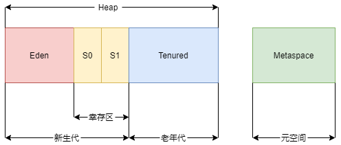

而 *G1* 的各代存储地址是不连续的，每一代都使用了 *n* 个不连续的大小相同的 *Region*，每个* Region* 占有一块连续的虚拟内存地址。如下图所示：

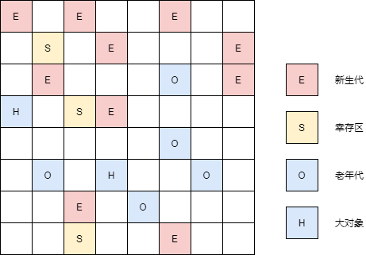

*G1* 的堆结构就是把一整块内存区域切分成多个固定大小的块，每一块被称为一个 *Region* 。在JVM在启动时来决定每个小块，也就是 *Region* 的大小。 JVM一般是把一整块堆切分成大约 *2000* 个 *Region* 。每个小 *Region* 从 *1* 到 *32Mb* 不等，且是 *2* 的指数，如果不设定，那么G1会根据Heap大小自动决定。这些 *Region* 最后又被分别标记为*Eden* , *Survivor* 和 *Old* 。这里的 *Eden* ， *Survivor* 和old已经是一个标签，也就是说只是一个逻辑表示，不是物理表示。*O*表示老生代（ *Old* ），*E*表示 *Eden* ，*S*表示 *Survivor* 。为了明了，我们分别用三种不同的颜色区分。存活下来的对象就被虚拟机从一个 *Region* 里被移动到另一个中。这些小块 *Region* 的回收是并行回收的，期间其他的应用线程照常工作。和以往的回收器一样， *G1* 中也有 *Eden* , *Survivor* , *Old* 。在这三个之外，还增加了第四种类型，叫 *Humongous* 。这个单词翻译过来就是“堆积如山”的意思。这个类型主要是用来存储那些比标准块大50%，甚至更大的那些对象。这些大对象被保存到一整块连续的区域。这个堆积如山区就是堆里没有被使用的区域。记住一点： *G1* 不是像老一辈的那些垃圾回收器一样要求每一代的块是连续的，在 *G1* 中可以不是连续的。

### STAB

*Snapshot-At-The-Beginning* ，由字面理解，是 *GC* 开始时活着的对象的一个快照。它是通过*Root Tracing* 得到的，作用是维持并发 *GC* 的正确性。 
根据三色标记算法，我们知道对象存在三种状态： 
- **白**：对象没有被标记到，标记阶段结束后，会被当做垃圾回收掉。
- **灰**：对象被标记了，但是它的field还没有被标记或标记完。 
- **黑**：对象被标记了，且它的所有field也被标记完了。

由于并发阶段的存在，*Mutator* 和 *Garbage Collector* 线程同时对对象进行修改，就会出现**白**对象漏标的情况，这种情况发生的前提是： 
- Mutator赋予一个**黑**对象该**白**对象的引用。 
- Mutator删除了所有从**灰**对象到该**白**对象的直接或者间接引用。

对于第一个条件，在并发标记阶段，如果该**白**对象是 *new* 出来的，并没有被**灰**对象持有，那么它会不会被漏标呢？Region中有两个 *top-at-mark-start(TAMS)* 指针，分别为 *prevTAMS* 和 *nextTAMS*。在 *TAMS* 以上的对象是新分配的，这是一种隐式的标记。对于在 *GC* 时已经存在的**白**对象，如果它是活着的，它必然会被另一个对象引用，即条件二中的**灰**对象。如果**灰**对象到**白**对象的直接引用或者间接引用被替换了，或者删除了，**白**对象就会被漏标，从而导致被回收掉，这是非常严重的错误，所以*SATB* 破坏了第二个条件。也就是说，一个对象的引用被替换时，可以通过 *Write Barrier* 将旧引用记录下来。

*SATB* 也是有副作用的，如果被替换的**白**对象就是要被收集的垃圾，这次的标记会让它躲过GC，这就是 *float garbage*。因为 *SATB*的做法精度比较低，所以造成的 *Float Garbage* 也会比较多。

### RSet - Remembered Set

每个 *Region* 初始化时，会初始化一个 *Remembered Set* ，简称 *RSet*，该集合用来记录并跟踪其它 *Region* 指向该 *Region* 中对象的引用，每个 *Region* 默认按照 *512Kb* 划分成多个 *Card* ，所以 *RSet* 需要记录的东西应该是 *Region-n* 的 *Card-n*。

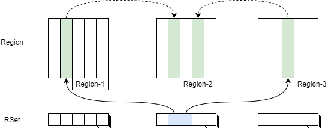

*G1 GC* 将一组或多组区域（称为回收集 (*CSet*)）中的存活对象以增量、并行的方式复制到不同的新区域来实现压缩，从而减少堆碎片。目标是从可回收空间最多的区域开始，尽可能回收更多的堆空间，同时尽可能不超出暂停时间目标（垃圾优先）。

*G1 GC* 使用独立的记忆集 (*RSet*) 跟踪对区域的引用。独立的 *RSet* 可以并行、独立地回收区域，因为只需要对区域（而不是整个堆）的 *RSet* 进行区域引用扫描。*G1 GC* 使用后 *Write Barrier* 记录堆的更改和更新 *RSet*。

### *Pause Prediction Model*

*Pause Prediction Model* 即停顿预测模型，*G1* 使用暂停预测模型来满足用户定义的暂停时间目标，并根据指定的暂停时间目标选择要收集的区域数量。

*G1 GC* 是一个响应时间优先的*GC* 算法，它与 *CMS* 最大的不同是，用户可以设定整个 *GC* 过程的期望停顿时间，参数 `-XX:MaxGCPauseMillis` 指定一个 *G1* 收集过程目标停顿时间，默认值 `200ms`，不过它不是硬性条件，只是期望值。那么 *G1* 怎么满足用户的期望呢？就需要这个停顿预测模型了。*G1* 根据这个模型统计计算出来的历史数据来预测本次收集需要选择的 *Region* 数量，从而尽量满足用户设定的目标停顿时间。 停顿预测模型是以衰减标准偏差为理论基础实现的。

## *GC* 过程
### *GC* 步骤

#### 年轻代 *GC*

##### G1中的年轻代
堆内存将被分割为大约 2000 个 *Region*。最小为 *1Mb*，最大为 *32Mb*，一般为 *1Mb* ， *2Mb* ， *4Mb* ， *8Mb* ， *16Mb* ， *32Mb*  ，为 *2* 的倍数。

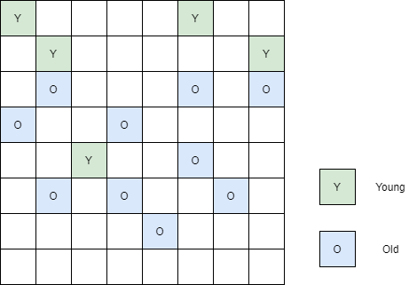

##### *G1* 中的 *Young GC*

存活对象被疏散（即，复制或移动）到一个或多个幸存区域。 如果满足老年化阈值，则将一些对象提升到老年代区域。

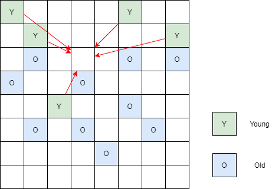

这是一个 *STW* 的暂停。 为下一个 *Young GC* 计算 *Eden* 大小和 *Suvivor* 大小。 保留暂停时间目标之类的信息来帮助计算大小。

使用这样的方法可以很容易地调整区域的大小，根据需要弹性伸缩。

##### *Young GC* 结束后

存活对象被疏散到 *Survivor* 区域或 *Old* 区域。

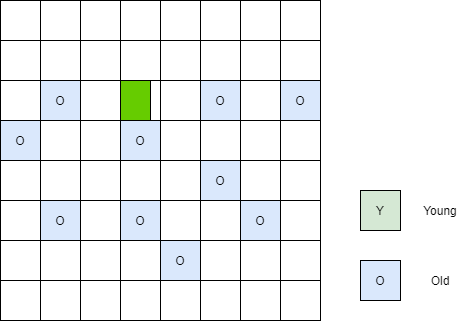

##### 总结

综上所述，关于 *G1* 中的年轻代有如下描述：

- 堆是分割成区域的单个内存空间。

- 年轻代内存由一组不连续的区域组成。 能够在需要时调整大小。

- 年轻代垃圾回收，称为 *Young GC*，是 *STW* 事件，需要停止所有应用程序线程来进行操作。

- *Young GC* 使用多个线程并行完成。

- 存活对象被复制到新的 *Survivor* 或 *Old* 区域。

#### 老年代 GC

与 *CMS GC* 一样，*G1 GC* 被设计为老年代对象的低暂停收集器。 下表描述了老年代的 *G1* 收集阶段。

| 阶段 | *STW* | 描述 |
| -------- | -- | ------- |
| 初始标记 | *STW* | 对于 G1，它将在 *Young GC* 中运行。标记可能引用老年代对象的幸存者区域（根区域）。 |
| 根区域扫描 | | 在 *Survivor* 区中扫描引用到老年代的引用。本阶段需要确保在 *Young GC* 发生前完成。 |
| 并发标记 | | 在整个堆中寻找存活对象，此阶段可能会被 *Young GC* 打断。 |
| 再次标记 | *STW*  | 使用 *SATB* 算法完成对堆中存活对象的标记，该算法比 *CMS* 中的算法更快。 |
| 清理 | *STW* | 1. 记录存活对象和完全空白的区域。（STW）; 2. 清理 *RSet*。（STW）; 3. 重置空区域并将它们返回到空闲列表。 （并发）|
| 复制 | *STW* | 这些是以 *STW* 的形式将存活对象疏散或复制到新的未使用区域。 `[GC pause (young)]`为完成 *Young GC* 的记录。或者是以`[GC Pause (mixed)]`为记录的年轻代和年老代区域。 |

##### 初始标记

存活对象的初始标记将在 *Young GC* 中进行。在日志中，这被标记为 ` GC pause (young)(inital-mark)`。

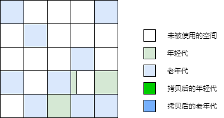

##### 并发标记

如果发现空 *Region*（如“X”所示），则在 *再次标记* 阶段立即将其删除。此外，也将记录计算的确定活跃度信息。

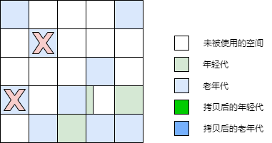

##### 再次标记

删除并回收空 *Region*，并计算所有 *Region* 的区域活跃度。

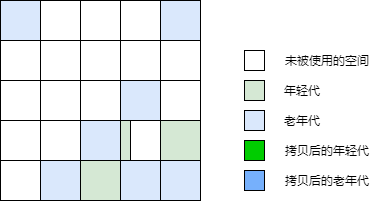

##### 复制/清理

*G1* 选择 “活跃度” 最低的 *Region* ，那些可以最快完成收集的 *Region* 。然后这些 *Region* 在 *Young GC* 进行的同时被收集。在日志中表示为 [GC pause (mixed)]。所以年轻代和年老代将被同时收集。

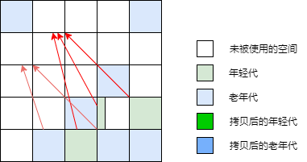

##### 复制/清理 后

选定的区域已被收集并压缩为图中所示的深蓝色区域和深绿色区域。

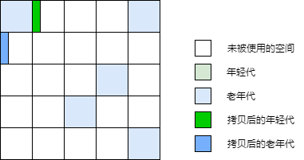

##### 总结

这里有几个老年代 *GC* 的关键点:

- 并发标记阶段
    - 存活度信息是在程序运行期间并发计算的
    - 存活度标明了在疏散暂停的时期哪些 *Region* 更适合被回收。
    - 没有像 *CMS* 一样的清扫阶段
- 再次标记阶段
    - 使用了比 *CMS* 快很多的 *Snapshot-at-the-Beginning (SATB)* 算法
    - 完全空白的 *Region* 将会被回收
- 复制/清理阶段
    - 年轻代和老年代将会在同一时间被回收
    - 基于存活度选择需要回收的老年代 *Region*

### *GC* 模式

#### *Young GC*
选定所有年轻代里的 *Region* 。通过控制年轻代的 *Region* 个数，即年轻代内存大小，来控制*Young GC* 的时间开销。

#### *Mixed GC*
选定所有年轻代里的 *Region* ，外加根据 *Global Concurrent Marking* 统计得出收集收益高的若干老年代 *Region* 。在用户指定的开销目标范围内尽可能选择收益高的老年代 *Region* 。

*Mixed GC* 不是 *Full GC* ，它只能回收部分老年代的 *Region* ，如果 *Mixed GC* 实在无法跟上程序分配内存的速度，导致老年代填满无法继续进行 *Mixed GC* ，就会使用 *Serial Old GC (Full GC)* 来收集整个 *GC heap* 。所以我们可以知道，*G1* 是不提供 *Full GC* 的。

### *GC* 日志

#### 启动参数
```bash
java -jar gs-service-0.0.1-SNAPSHOT.jar -XX:+PrintGCDetails -XX:+PrintGCDateStamps -XX:+PrintHeapAtGC -XX:+PrintTenuringDistribution -XX:+PrintGCApplicationStoppedTime -XX:+PrintReferenceGC -Xloggc:/home/logs/gc/gc-%t.log -XX:+UseGCLogFileRotation -XX:NumberOfGCLogFiles=20 -XX:GCLogFileSize=5M
```

| 参数 | 描述 |
| :-- | :-- |
| `-XX:+PrintGCDetails` | 打印 GC 详情 |
| `-XX:+PrintGCDateStamps` | 打印 GC 时间戳|
| `-XX:+PrintHeapAtGC` | 打印 GC 时的堆信息|
| `-XX:+PrintTenuringDistribution` | 在每次 *Young GC* 时，打印出幸存区中对象的年龄分布 |
| `-XX:+PrintGCApplicationStoppedTime` | 打印 GC 时应用停顿时间 |
| `-XX:+PrintReferenceGC` | 记录回收了多少不同引用类型的引用 |
| `-Xloggc:/home/logs/gc/gc-%t.log` | 指定 GC 日志位置与文件格式|
| `-XX:+UseGCLogFileRotation`| 启用滚动日志|
| `-XX:NumberOfGCLogFiles=20` | 最大日志数量 |
| `-XX:GCLogFileSize=5M` | 单个日志最大大小 |

#### 日志详情
```
{Heap before GC invocations=0 (full 0):
 garbage-first heap   total 6291456K, used 313344K [0x0000000660800000, 0x0000000660a06000, 0x00000007e0800000)
  region size 2048K, 153 young (313344K), 0 survivors (0K)
 Metaspace       used 32143K, capacity 32576K, committed 33024K, reserved 1077248K
  class space    used 4199K, capacity 4318K, committed 4352K, reserved 1048576K
2021-08-04T17:09:15.956+0900: 4.167: [GC pause (G1 Evacuation Pause) (young), 0.0316564 secs]
   [Parallel Time: 15.5 ms, GC Workers: 4]
      [GC Worker Start (ms): Min: 4167.1, Avg: 4167.7, Max: 4168.1, Diff: 1.1]
      [Ext Root Scanning (ms): Min: 1.4, Avg: 2.9, Max: 4.9, Diff: 3.5, Sum: 11.5]
      [Update RS (ms): Min: 0.0, Avg: 0.0, Max: 0.0, Diff: 0.0, Sum: 0.0]
         [Processed Buffers: Min: 0, Avg: 0.0, Max: 0, Diff: 0, Sum: 0]
      [Scan RS (ms): Min: 0.0, Avg: 0.0, Max: 0.1, Diff: 0.1, Sum: 0.2]
      [Code Root Scanning (ms): Min: 0.0, Avg: 0.8, Max: 2.3, Diff: 2.3, Sum: 3.4]
      [Object Copy (ms): Min: 9.9, Avg: 10.6, Max: 12.4, Diff: 2.5, Sum: 42.5]
      [Termination (ms): Min: 0.0, Avg: 0.5, Max: 0.6, Diff: 0.6, Sum: 1.9]
         [Termination Attempts: Min: 1, Avg: 11.2, Max: 16, Diff: 15, Sum: 45]
      [GC Worker Other (ms): Min: 0.0, Avg: 0.0, Max: 0.0, Diff: 0.0, Sum: 0.1]
      [GC Worker Total (ms): Min: 14.4, Avg: 14.9, Max: 15.5, Diff: 1.0, Sum: 59.5]
      [GC Worker End (ms): Min: 4182.5, Avg: 4182.5, Max: 4182.6, Diff: 0.0]
   [Code Root Fixup: 0.1 ms]
   [Code Root Purge: 0.0 ms]
   [Clear CT: 0.2 ms]
   [Other: 15.8 ms]
      [Choose CSet: 0.0 ms]
      [Ref Proc: 14.3 ms]
      [Ref Enq: 0.1 ms]
      [Redirty Cards: 0.1 ms]
      [Humongous Register: 0.2 ms]
      [Humongous Reclaim: 0.0 ms]
      [Free CSet: 0.3 ms]
   [Eden: 306.0M(306.0M)->0.0B(278.0M) Survivors: 0.0B->28672.0K Heap: 306.0M(6144.0M)->26902.6K(6144.0M)]
Heap after GC invocations=1 (full 0):
 garbage-first heap   total 6291456K, used 26902K [0x0000000660800000, 0x0000000660a06000, 0x00000007e0800000)
  region size 2048K, 14 young (28672K), 14 survivors (28672K)
 Metaspace       used 32143K, capacity 32576K, committed 33024K, reserved 1077248K
  class space    used 4199K, capacity 4318K, committed 4352K, reserved 1048576K
}
```

| 指标 | 值 | 解释 |
| :-- | :-- | :-- |
| *GC* 原因| GC pause (G1 Evacuation Pause) (young) | 发生 *Young GC* |
| *GC* 时间 | 0.0316564 secs | |
| *Eden* 区容量变化 | 306.0M -> 278.0M |
| *Eden* 区大小变化 | 306.0M -> 0.0B |
| *Survivor* 区容量变化 | 0.0B -> 28672.0K |
| *Heap* 容量变化 | 6144.0M -> 6144.0M|
| *Heap* 大小变化 | 306.0M -> 26902.6K|

## 参数调整
### 参数详解

| 参数 | 含义 |
| :--- | :--- |
| `-XX:+UseG1GC` | 启用*G1 GC* |
| `-XX:G1HeapRegionSize=n` | 设置Region大小，并非最终值 |
| `-XX:MaxGCPauseMillis=200` | 设置G1收集过程目标时间，默认值200ms，不是硬性条件|
| `-XX:G1NewSizePercent=5` | 新生代最小值，默认值5%|
| `-XX:G1MaxNewSizePercent=60` | 新生代最大值，默认值60% |
| `-XX:ParallelGCThreads=n` | *STW* 期间，并行GC线程数 |
| `-XX:ConcGCThreads=n` | 并发标记阶段，并行执行的线程数 |
| `-XX:InitiatingHeapOccupancyPercent=45` | 设置触发标记周期的 *Java* 堆占用率阈值。默认值是 *45%*。这里的 *Java* 堆占比指的是非 *Young Region* 的大小占比 ，包括 *Old* 与 *Humongous* |
| `-XX:G1MixedGCLiveThresholdPercent=65` | 为混合垃圾回收周期中要包括的旧区域设置占用率阈值，默认占用率为 *65%* 。|
| `-XX:G1HeapWastePercent=10`| 设置您愿意浪费的堆百分比。如果可回收百分比小于堆废物百分比，*Java HotSpot VM* 不会启动混合垃圾回收周期。默认值是 *10%*。|
| `-XX:G1MixedGCCountTarget=8` | 设置标记周期完成后，对存活数据上限为 *G1MixedGCLIveThresholdPercent* 的旧区域执行混合垃圾回收的目标次数。默认值是 *8* 次混合垃圾回收，混合回收的目标是要控制在此目标次数以内。|
| `-XX:G1OldCSetRegionThresholdPercent=10` | 设置混合垃圾回收期间要回收的最大旧区域数，默认值是 *Java* 堆的 *10%。*|
| `-XX:G1ReservePercent=10` | 设置作为空闲空间的预留内存百分比，以降低目标空间溢出的风险,默认值是 *10%*。|

### 建议
评估和微调 *G1 GC* 时，请记住以下建议：

- **年轻代大小**：避免使用 -Xmn 选项或 -XX:NewRatio 等其他相关选项显式设置年轻代大小。固定年轻代的大小会覆盖暂停时间目标。

- **暂停时间目标**：每当对垃圾回收进行评估或调优时，都会涉及到延迟与吞吐量的权衡。*G1 GC* 是增量垃圾回收器，暂停统一，同时应用程序线程的开销也更多。*G1 GC* 的吞吐量目标是 *90%* 的应用程序时间和 *10%* 的垃圾回收时间。如果将其与 *Java HotSpot VM* 的吞吐量回收器相比较，目标则是 *99%* 的应用程序时间和 *1%* 的垃圾回收时间。因此，当您评估 *G1 GC* 的吞吐量时，暂停时间目标不要太严苛。目标太过严苛表示您愿意承受更多的垃圾回收开销，而这会直接影响到吞吐量。当您评估 *G1 GC* 的延迟时，请设置所需的（软）实时目标，*G1 GC* 会尽量满足。副作用是，吞吐量可能会受到影响。

- 掌握混合垃圾回收：当您调优混合垃圾回收时，请尝试以下选项：

    - `-XX:InitiatingHeapOccupancyPercent` 用于更改标记阈值。
    - `-XX:G1MixedGCLiveThresholdPercent 和 -XX:G1HeapWastePercent` 当您想要更改混合垃圾回收决定时。
    - `-XX:G1MixedGCCountTarget` 和 `-XX:G1OldCSetRegionThresholdPercent` 当您想要调整旧区域的 *CSet* 时。

## 总结
*G1 GC* 是区域化、并行-并发、增量式垃圾回收器，相比其他 *HotSpot* 垃圾回收器，可提供更多可预测的暂停。增量的特性使 *G1 GC* 适用于更大的堆，在最坏的情况下仍能提供不错的响应。*G1 GC* 的自适应特性使 *JVM* 命令行只需要软实时暂停时间目标的最大值以及 *Java* 堆大小的最大值和最小值，即可开始工作。

## 参考
1. [Getting Started with the G1 Garbage Collector](https://www.oracle.com/technetwork/tutorials/tutorials-1876574.html)
2. [The Garbage First Garbage Collector](https://www.oracle.com/java/technologies/javase/hotspot-garbage-collection.html)
3. [垃圾优先型垃圾回收器调优](https://www.oracle.com/cn/technical-resources/articles/java/g1gc.html)
4. [Java Hotspot G1 GC的一些关键技术](https://tech.meituan.com/2016/09/23/g1.html)
5. [一步步图解G1](https://blog.didispace.com/step-by-step-g1/)
6. [徹底解剖「G1GC」実装編](https://github.com/authorNari/g1gc-impl-book)
7. [Part 1: Introduction to the G1 Garbage Collector](https://www.redhat.com/zh/blog/part-1-introduction-g1-garbage-collector)
8. [Collecting and reading G1 garbage collector logs - part 2](https://www.redhat.com/en/blog/collecting-and-reading-g1-garbage-collector-logs-part-2)