## 简述

*Dump* 文件将某一时刻的 *Java Heap* 保存下来，便于分析问题。除了可以通过 *jmap* 命令手动触发 *Dump* 操作；也可以在 *JVM* 启动参数里，通过添加 `-XX:+HeapDumpOnOutOfMemoryError -XX:HeapDumpPath=<LOG_PATH>` 来设置应用在发生 *OOM* 时将 *Java Heap* 保存下来，便于后面的问题分析与解决。

在服务器中可以很容易获得 *Dump* 文件，但是分析却是一个非常消耗服务器资源的操作。对内存的影响，在默认情况下启动 *jhat* 可能在打开 *3GB* 大小的 *Dump* 文件时因为内存不足发生  *OOM* 的问题，但如果给 *jhat* 分配过大的堆内存，可能会影响应用正常运行。对 *CPU* 的影响，分析时会大幅度占用 *CPU* 时间，可能会影响应用的正常运行。因此，需要将 *Dump* 文件放置到本地进行分析。

### 本地获取 *Dump* 文件
#### 获取应用 *PID*
```bash
$ jps
30444 rest-service-0.0.1-SNAPSHOT.jar
9460 Jps
```

#### 获取 *Dump* 文件
##### 所有对象
```bash
$ jmap -dump:format=b,file=./dump.hprof 30444
Dumping heap to E:\temp\dump.hprof ...
Heap dump file created
```

##### 存活对象
```bash
$ jmap -dump:live,format=b,file=./dump_live.hprof 30444
Dumping heap to E:\temp\dump_live.hprof ...
Heap dump file created
```
存活对象的 *Dump* 操作将会触发一次 *Full GC*

#### 将 *Dump* 文件分割

```bash
$ split -b 100M -d dump.hprof
$ ls
dump.hprof x00 x01 x02
```

##### 参数详情

| 参数 | 描述 |
| :-- | :-- |
| `-b 100M` | 分割文件大小为 *100MB* |
| `-d` | 加上该参数后，分割后的文件将使用数字后缀；反之，分割文件名将是字母后缀。详情见下表。 |

##### 分割文件格式
| 类型 | 样例 |
| :-- | :-- |
| 数字后缀 | *x01* *x02* *x03* |
| 字母后缀 | *xaa* *xab* *xac* |

#### 分割文件传输
将分割文件传输至本地保存

#### 分割文件合并
该步骤样例在 *Windows 10* 上的 *CMD* 运行。（ \* 使用 *PowerShell* 可能导致运行失败）

```cmd
C:\dump>copy /b x* dump.hprof
x00
x01
x02
Copied       1 file
C:\dump>dir
dump.hprof x00 x01 x02
```

**这样就在本地获得了服务器中的 *Dump*  文件**

### *Dump* 分析
#### *jhat*

```cmd
C:\dump>jhat -port 8081 dump_live.hprof
Reading from dump_live.hprof...
Dump file created Thu Aug 19 16:47:50 CST 2021
Snapshot read, resolving...
Resolving 188752 objects...
Chasing references, expect 37 dots.....................................
Eliminating duplicate references.....................................
Snapshot resolved.
Started HTTP server on port 8081
Server is ready.
```

使用 *CMD* 启动 *jhat* 分析 *Dump* 文件，并可以在本地 *8081* 端口上查看分析结果。

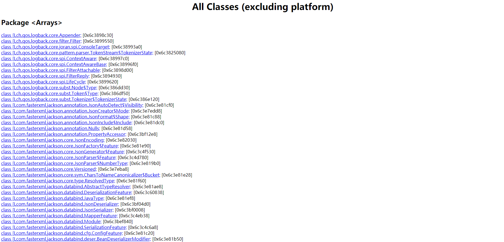

#### *Visual VM* by *Oracle JDK*

*Visual VM* 是仅包含在  *Oracle JDK* 中一款 *GUI* 工具，其功能主要能够完成 *JConsole* 的监控功能以及对 *Dump* 文件的可视化呈现。

##### 打开 *Dump* 文件选择框

点击 *[文件] -> [装入]* 打开文件选择框

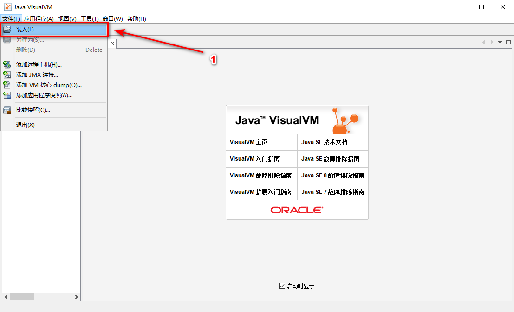

##### 选择并打开 *Dump* 文件

1. 选择文件类型为 *堆Dump （\*.hprof）*
2. 选择需要分析的 *Dump* 文件
3. 点击确定开始分析

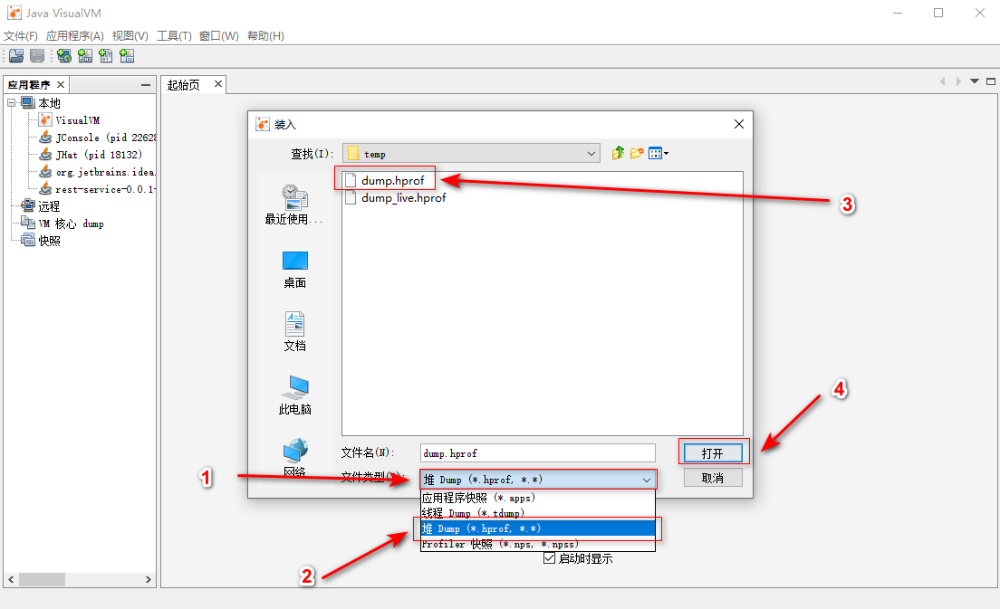

##### 查看 *Dump* 文件概要
1. 展示基本信息，包括文件名、日期、大小等文件基本信息和加载字节、类总数等堆内存基本信息。
2. 展示运行环境。

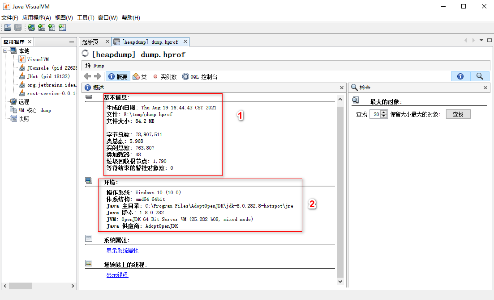

##### 类分析

1. 选择 *类* 选项卡
2. 可以获得各对象的类型、数量、大小信息，为分析提供数据支持。

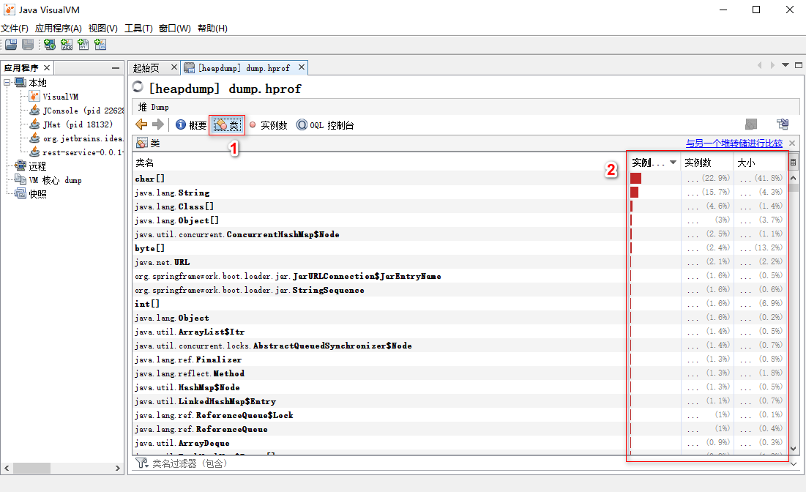

##### `OQL`

1. 选择 *OQL* 选项卡
2. 输入 *OQL* 语句
3. 点击执行并等待执行完成
4. 在 “查询结果” 中查看结果

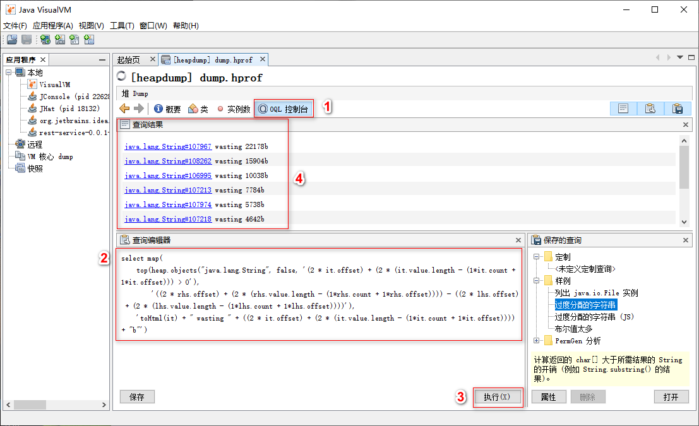

#### *MAT* by *Eclipse*

*MAT* 全称为 *Memory Analyzer Tool* ，一个基于 *Eclipse* 的内存分析工具,是一个快速、功能丰富的 *JAVA heap* 分析工具,它可以帮助我们查找内存泄漏和减少内存消耗。

*MAT* 可以在 [www.eclipse.org/mat/](https://www.eclipse.org/mat/) 下载

##### 打开 *Dump* 文件

1. 点击 *[File]*
2. 点击 *[Open Heap Dump...]*
3. 选择 *Dump* 文件
4. 点击确定开始分析

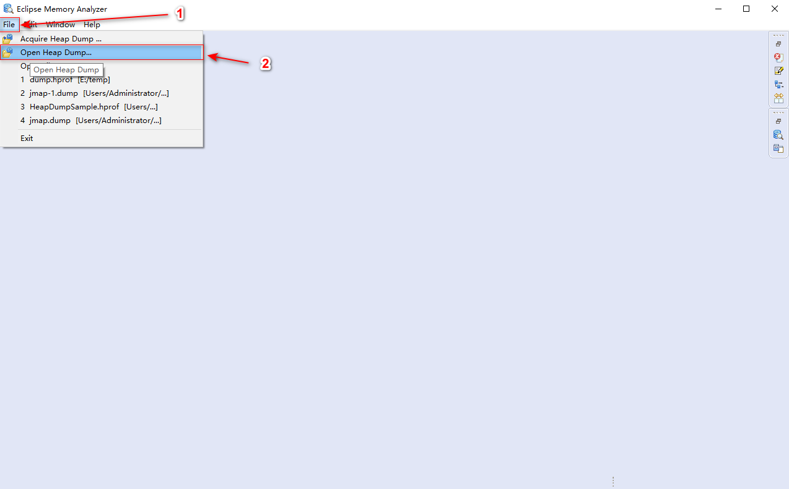

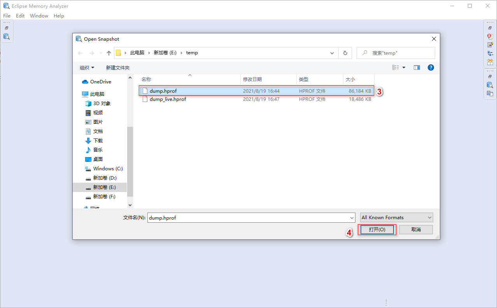

##### 默认启动报告

开始使用工具时，加载 Dump 文件完毕后将会有一个选择框弹出，可以选择一种默认的报告类型。
默认报告为内存泄漏报告。

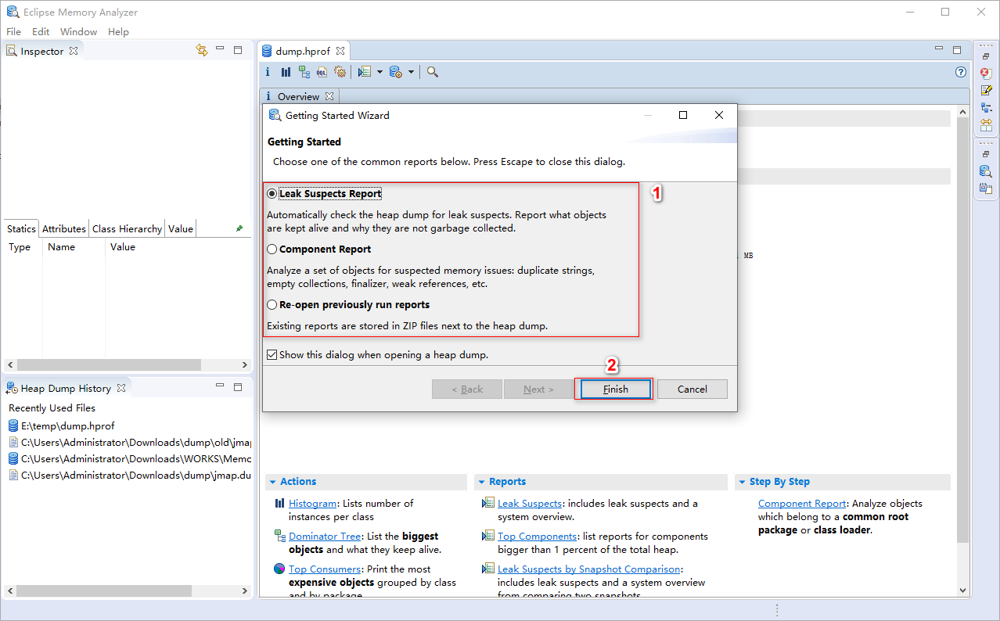

##### 概览

概览页中可以通过饼图查看大对象的分布。另外也有其他的多重功能。

- Actions
  - Histogram
    - 直方图
    - 列出每个类的实例数。
  - Dominator Tree
    - 支配树
    - 列出最大的类以及什么导致它们存活。
  - Top Comsumers
    - 消费者 *Top* 列表
    - 打印按类和包分组的最大的对象。
  - Duplicate Classes
    - 重复类
    - 检测由多个类加载器加载的类。
- Reports
  - Leak Suspects
    - 泄漏嫌疑
    - 包括泄漏嫌疑和系统概述。
  - Top Components
    - 组件 *Top* 列表
    - 列出大于堆内存 *1%* 的组件。
  - Leak Suspects by Snapshot Comparison
    - 通过快照比较检测泄漏
    - 比较两个快照展示泄漏嫌疑和系统概述。
- Step By Step
  - Component Report
    - 组件报告
    - 分析属于公共根包或类加载器的对象。

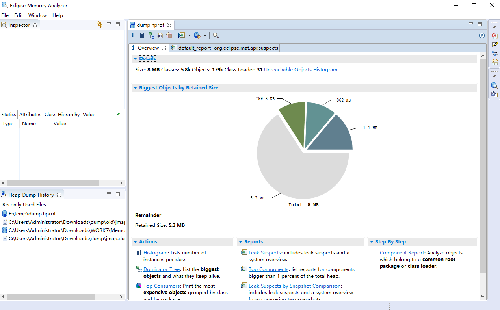

##### *MAT* 启动参数配置

通过打开 *MemoryAnalyzer.ini* 文件，进行参数配置。
如图所示，加入 `-xmx6g` 指定 *MAT* 启动的堆内存最大为 *6G*，为防止 *MAT* 分析 *Dump* 文件抛出 *OOM* 错误

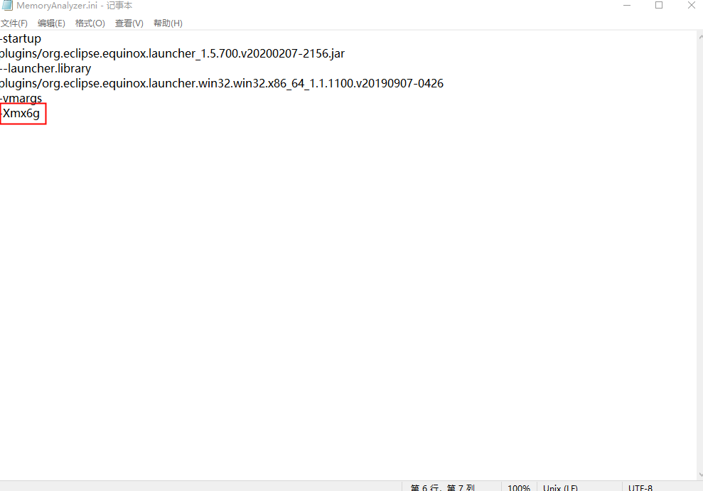

## 总结

*Dump* 文件保存了 *Java Heap* 的完整信息，能够有助于我们分析内存。除此之外，也应与其他工具相结合，从多个维度上分析内存结构，便于我们尽快获得答案。
